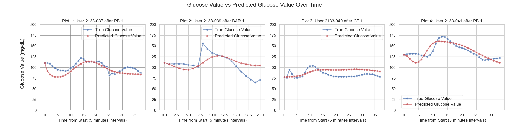

# Round 2
This project is part of Round 2 Math Modeling contest 2024. 
## Overview
This project builds a mathematical model to simulate the glucose-insulin interaction using real patient meal data. It is trained using gradient descent optimization on pre-trained and fine-tuned data to predict glucose levels effectively.


### Features
- Glucose-Insulin interaction simulation based on differential equations.
- Support for multiple types of nutrition models (Gaussian, Gamma, Mixed, KAN).
- Configurable pre-training and fine-tuning steps.
### Setup
To User the project, follow these steps:

1. Install the required dependencies:
    ```bash
    pip install -r requirements.txt
    ```

2. To run the pretrain script:
    ```bash
    python pretrain.py
    ```

Pretrain script can be run with different configs by adding the data to the `data` folder and changing the configurations in `config.yaml`. 

Using Hydra, it's also possible to change configurations directly from the command line. For example:
```bash
python pretrain.py model.lr=0.01
```

3. Finetune tutorials can be found in the `finetuning.ipynb` notebooks in the `notebooks` folder.

## Folder Structure
```
round2/
│
├── configs/                 # Configuration file for the project
│
├── data/                    # Data files
│   ├── user-2133-036/       # Data for user 2133-036
│   ├── user-2133-037/       # Data for user 2133-037
│   ├── user-2133-039/       # Data for user 2133-039
│   ├── user-2133-040/       # Data for user 2133-040
│   ├── user-2133-041/       # Data for user 2133-041
│   ├── pretrain.tsv         # Pretrain data
│   └── nutritions.xlsx      # Nutritions data
│
├── figures/                 # Folder to store figures and plots
│
├── notebooks/               # Contain Jupyter notebooks for Round 2
│   └── finetune.ipynb       # Nutritions data
│
├── outputs/                 # Folder containing Hydra logs for Round 2
│
├── pretrained_models/       # Folder containing pretrained models (Gaussian, Gamma, Mixed, KAN)
│
├── src/                     # Source code for Round 2
│   ├── data/                # Folder for data processing scripts
│   │   └── __pycache__/
│   ├── models/              # Folder containing model implementations
│   │   ├── nutrition_models/ # Folder for nutrition models
│   │   │   ├── exponential_nutrition_models.py
│   │   │   ├── gamma_nutrition_models.py
│   │   │   ├── gaussian_nutrition_models.py
│   │   │   ├── kan_nutrition_models.py
│   │   │   └── mixed_nutrition_models.py
│   ├── utils/               # Utility scripts
│   │   └── utils.py
│   ├── __pycache__/
│   ├──  glucose_insulines.py # Contains glucose_insuline model implementation
│   └──  report.pdf           # Contains details of the mathematical model
```
Details of the mathematical model and methodology are provided in `report.pdf`.
